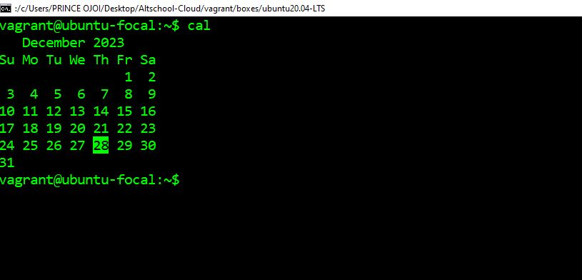
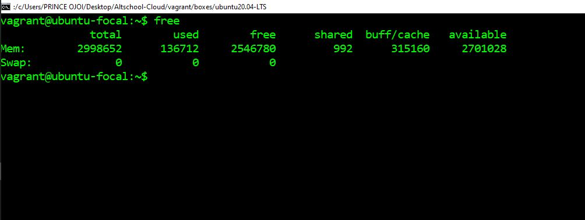
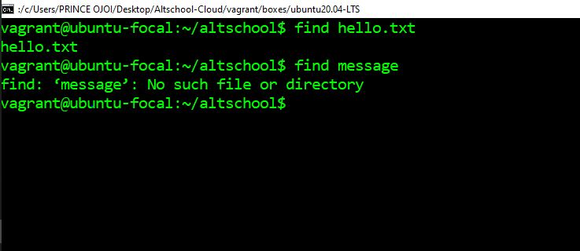
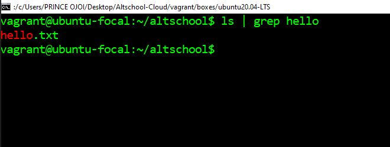
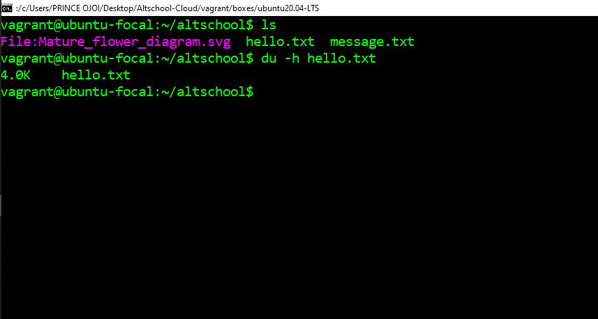
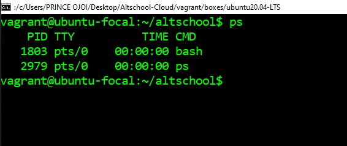
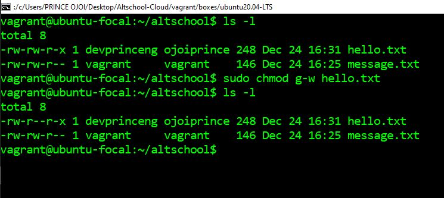
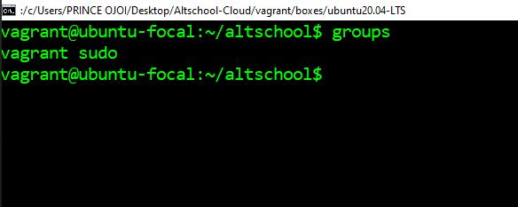
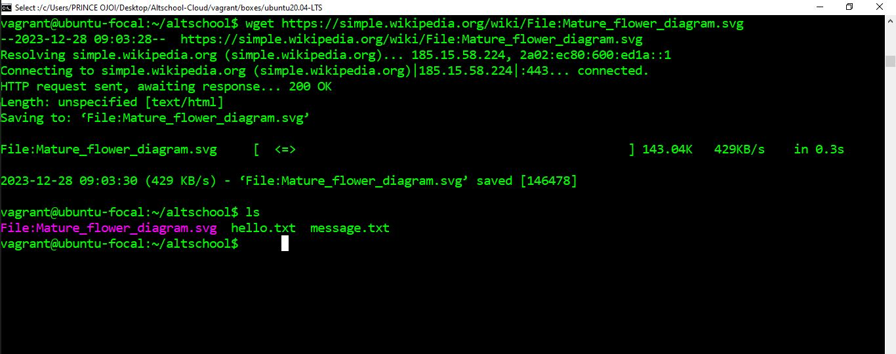
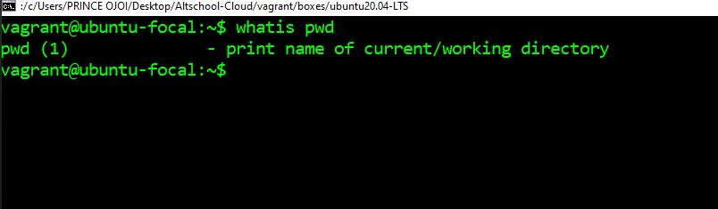

# Altschool Cloud Engineering Excercise 2

**Task:** Research online for 10 more linux commands aside the ones already mentioned in this module. Submit using your `altschool-cloud-exercises project`, explaining what each command is used for with examples of how to use each and example screenshots of using each of them.

# Linux Commands:

1. ```$ cal```: This command displays the calender

**_Usage:_**

<br/>

2. ```$ free```: This command displays the RAM usage

**_Usage:_**

<br/>

3. ```$ find ```:
   Lets you search for a file in a directory hierarchy.
**_Usage:_**

<br/>

4. ```$ grep ```:
   print lines that match patterns
**_Usage:_**

<br/>

5. ```$ du ```:
   Shows estimated occupied space
**_Usage:_**

<br/>

6. ```$ ps ```:
   report a snapshot of the current processes.
**_Usage:_**

<br/>

7. ```$ chmod ```:
   command to change file permissions.
**_Usage:_**

<br/>

8. ```$ groups ```:
   print the groups a user is in
**_Usage:_**

<br/>

9. ```$ wget ```:
   The non-interactive network downloader, lets us `download` files from the internet.
**_Usage:_**

<br/>

10. ```$ whatis ```:
    This command displays one-line manual descriptions of given commands
**_Usage:_**

<br/>